# 911realtime.org — User Guide

911realtime.org replays the media of September 11, 2001 — television, radio, pagers, news wires, newsgroups, flight radar, even the web itself — synchronized to a single clock, inside a Mac OS 8-style desktop as it might have looked on a computer of that era.

Everything on the desktop follows one **virtual clock**. When you first visit, that clock reads **8:40 AM Eastern, Tuesday, September 11, 2001** — six minutes before the first aircraft struck the World Trade Center. From that moment, every app plays forward together in real time: the TV networks are still airing morning shows, thousands of flights are in the air, and the country's pagers are carrying ordinary business traffic. What happens next unfolds exactly as it did.

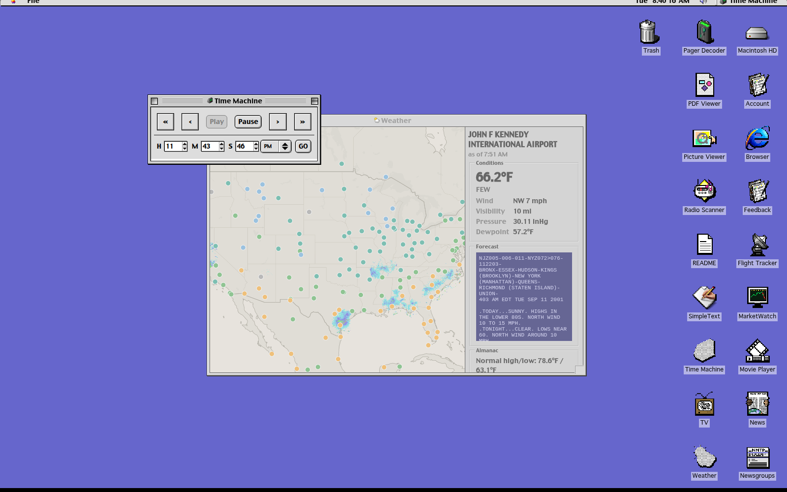

- **Use it now:** <https://beta.911realtime.org> (preview of version 2)
- **Report a bug or idea:** <https://github.com/Keeping-History/rt911/issues/new> — or use the built-in [Feedback](#feedback) app
- **Why we built this:** <https://youtu.be/q1ukl6G_s_M>

> **A note on the subject matter.** This is a documentary and educational archive of a day on which nearly 3,000 people were killed. The material is presented unedited and in real time on purpose — so it can be studied and remembered as it actually happened. Please explore it with that in mind.

---

## Quick Start — a first session

The desktop works like a classic Macintosh: **double-click a desktop icon** to open an app, drag windows by their title bars, and use the **File** menu of the active app for its settings. The menu-bar clock in the top-right corner always shows the virtual time — the time *in 2001* — not your local time.

Here is a fifteen-minute first journey that touches the most powerful parts of the site. You arrive at 8:40 AM; the first impact is at 8:46.

1. **Open TV.** The networks are in the last minutes of ordinary morning television. Pick a New York station like **WNYW** or a network like **CNN** from the thumbnail strip at the bottom. Around 8:49 AM, coverage begins to break in — and you'll see it happen live, channel by channel, each network reacting at its own pace.

2. **Open Flight Tracker.** Over 2,500 aircraft are aloft over North America. The four hijacked flights are drawn in red. Click **AA11** — northeast of New York, already descending — and its Flight Details panel opens with the route, aircraft, crew, and a drawn radar track. Leave this window open in a corner: at 9:26 AM the FAA orders a national ground stop, and over the following two hours you can watch the sky empty for the first time in aviation history.

3. **Open Pager Decoder.** Every pager message in the archive streams by in real time — market updates, "call me when you get in," automated network alerts. As the morning unfolds, you will see the character of the traffic change completely. This is one of the most affecting windows on the desktop; it needs no interaction at all.

4. **Open Radio Scanner.** Click a station button along the bottom — **WINS** and **WCBS** are New York news radio; **AA11**, **atc**, and **NEADS/NORAD** carry the air-traffic-control and air-defense recordings for the hijacked flights, synchronized to the moment they happened.

5. **Jump forward with Time Machine.** When you want to move through the day rather than live it minute-by-minute, open **Time Machine**, type a time (try **9:59 AM**, or **8:46 AM** to start over), and press **GO**. Every app — TV, radio, flights, pagers, news — seeks to that moment together.

6. **Open the Browser.** It loads the web *as it was archived that day*, via the Wayback Machine. Press the **CNN** favorite to see CNN.com's front page from the night of September 11. (On the hosted site this works out of the box; running locally requires the proxy — see [Running locally](#running-locally).)

7. **Open Macintosh HD.** Browse into **Documents → Newspapers → September 11** for 49 newspaper front pages from the following morning, from the *Akron Beacon Journal* to *Al-Hayat*. Double-click one to read it in the PDF Viewer.

A few reference times for Time Machine (all Eastern): **8:46** first impact (WTC North Tower) · **9:03** second impact (South Tower) · **9:26** FAA national ground stop · **9:37** Pentagon · **9:59** South Tower collapse · **10:03** United 93, Shanksville, PA · **10:28** North Tower collapse.

---

## The virtual clock

One clock drives the whole desktop. Every app reads it; only **Time Machine** (and a teacher's playlist, if one is active) can move it. The menu-bar clock shows it at all times.

- **Playback is real-time.** A minute of your time is a minute of September 11.
- **Seeking is global.** Jump the clock and every open app seeks together — TV channels change programs, the flight map redraws the sky, radio and pagers pick up from the new moment.
- **Your position persists.** Reloading the page resumes where you left off; a first-ever visit starts at 8:40 AM.

---

## The applications

### Flight Tracker

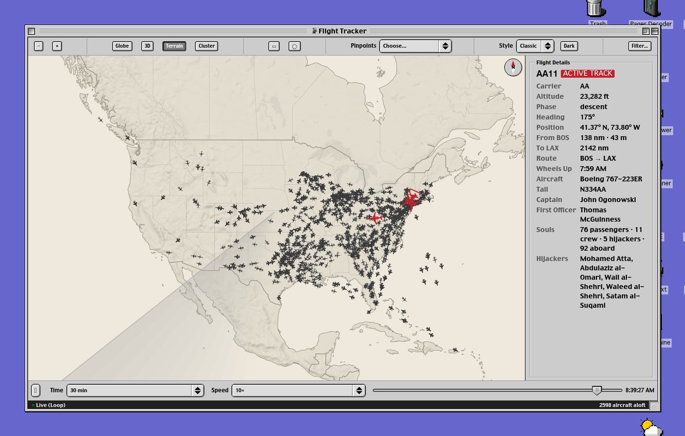

A live radar view of every commercial flight over North America — 3.4 million radar positions reconstructed from Bureau of Transportation Statistics data, with the four hijacked flights (drawn in red) curated from NTSB and RADES air-defense radar records. Aircraft are drawn with silhouettes matched to their real airframe.

- **Click any aircraft** to open its Flight Details: route, altitude, phase of flight, aircraft type, tail number — and for the notable flights, crew and passenger information.
- **Toolbar:** zoom, **Globe** projection, **3D** view (aircraft at true altitude, with terrain), **Terrain** relief, **Cluster** grouping at low zoom, rectangle/lasso region selection, a **Pinpoints** menu that flies the camera to significant sites, map **Style** (Classic / Radar / Satellite) plus a **Dark** toggle, and **Filter…** for narrowing by carrier, airport, or flight.
- **Bottom bar:** the replay loop. The map continuously replays the trailing **30 or 90 minutes** at up to 10× speed, so motion is always visible; the status bar shows the loop position and the number of aircraft aloft. Pause it to scrub manually.

### TV

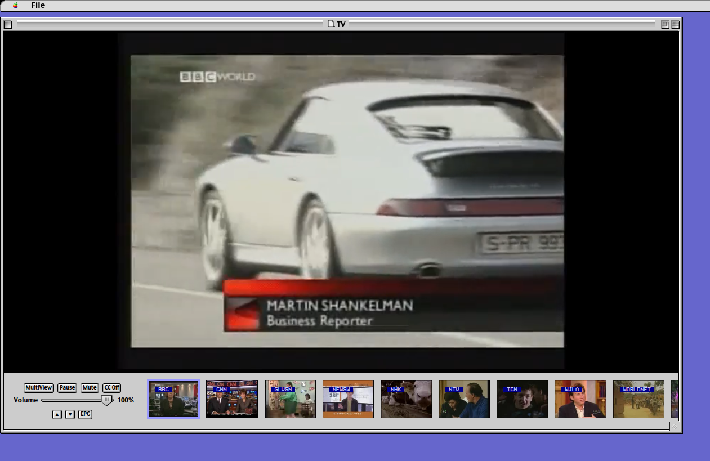

A multi-channel television tuned to the virtual clock — over two dozen channels including the major U.S. networks, New York and Washington local stations, and international broadcasters. The thumbnail strip along the bottom shows every channel playing live; click one to fill the main screen.

- **MultiView** tiles all channels at once; **EPG** opens a classic scrolling program guide.
- **CC** toggles closed captions (machine-transcribed); **File → Settings** lets you enable or disable channels and style the captions.
- Streams stay mounted in the background, so flipping between channels never loses your place — just like real TV.

### Radio Scanner

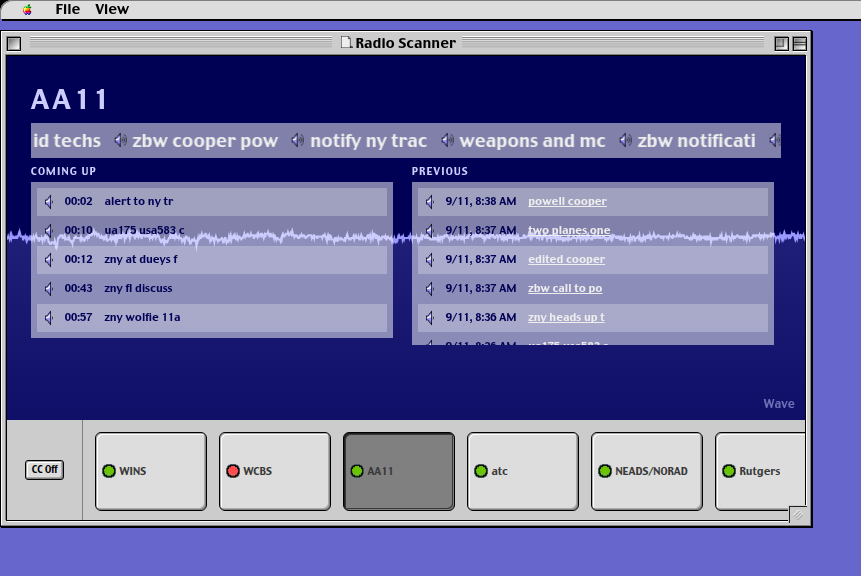

A scanner that tunes through period radio: New York news stations (WINS, WCBS), college radio (Rutgers), and the air-traffic-control and NORAD/NEADS recordings tied to the hijacked flights. Click a station button to tune it; the display shows what's playing now, what's coming up, and what you missed, over a live waveform. Audio keeps playing if you switch browser tabs.

### Pager Decoder

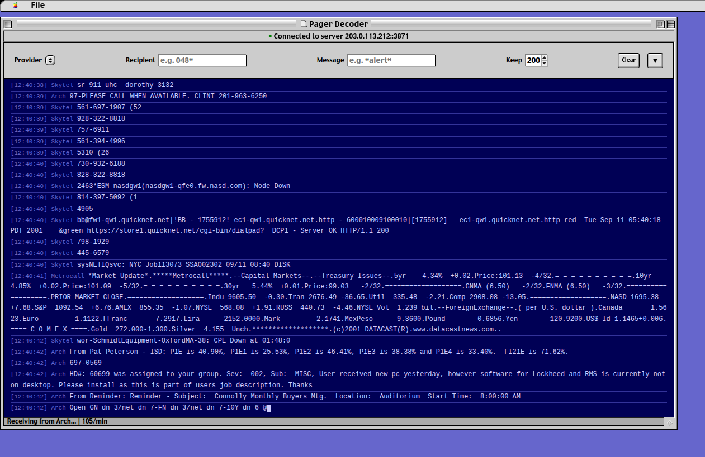

A live POCSAG/FLEX pager decoder streaming the archived pager traffic of September 11 — over 400,000 messages across the Arch, Metrocall, Skytel, and Weblink networks. Messages scroll by as they were transmitted, at whatever rate the moment produced (the status bar shows messages per minute). Filter by provider, recipient address, or message text; **Keep** controls how many lines stay in the buffer.

### News

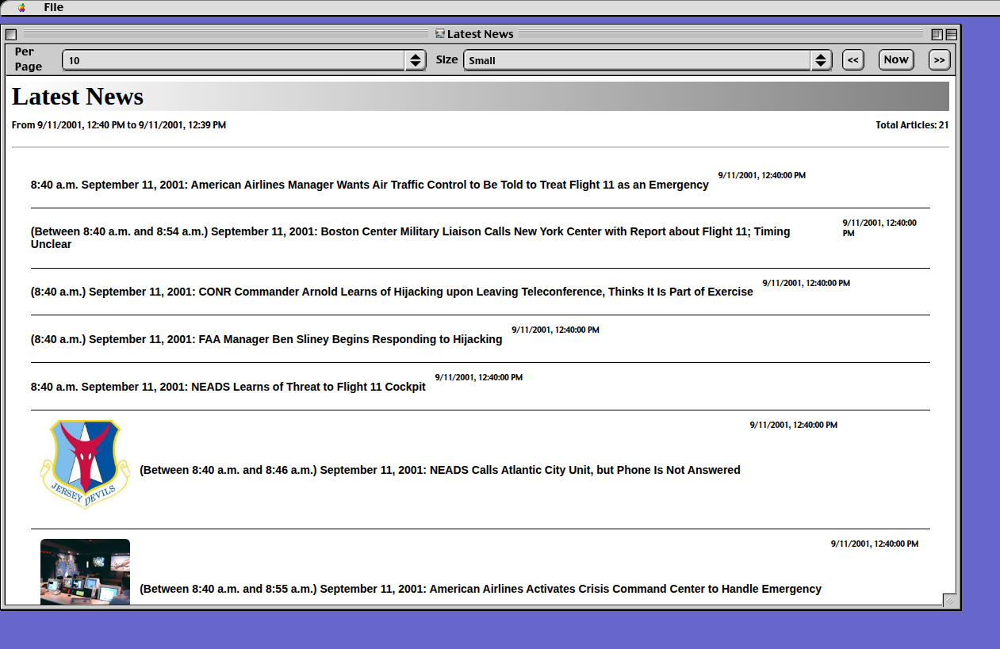

A news reader showing the documented timeline of the day as it was known *at the current virtual time* — new entries appear only once their moment has arrived. Entries carry sourcing and, where available, photographs. Page through with the arrow buttons, or press **Now** to jump to the most recent items; the **Per Page** and **Size** controls adjust the layout.

### Newsgroups

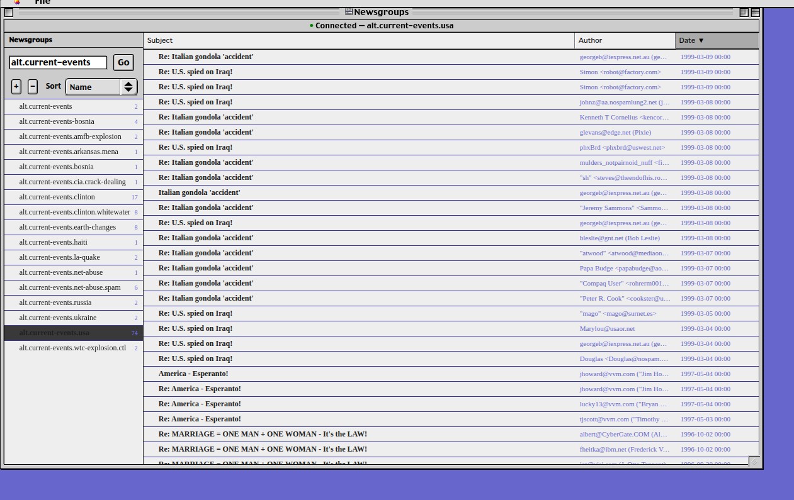

A Usenet reader over an archive of period newsgroups — the discussion internet of 2001. Type a group name fragment into the filter (try `alt.current-events`) and press **Go**, expand hierarchies with the disclosure triangles, and click a group to load its messages. Message bodies load on demand, exactly like a newsreader of the era.

### Weather

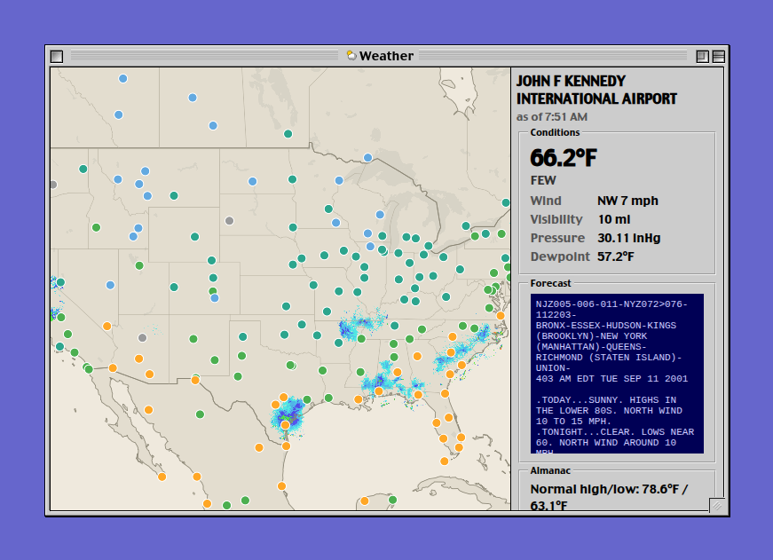

The national weather picture, synchronized to the clock: a station map with color-coded observations and NEXRAD radar echoes, and a conditions panel with the current METAR-style report, the National Weather Service zone forecast as issued that morning, and almanac data. It was, famously, a beautiful day in New York — severe clear, 10-mile visibility.

### MarketWatch

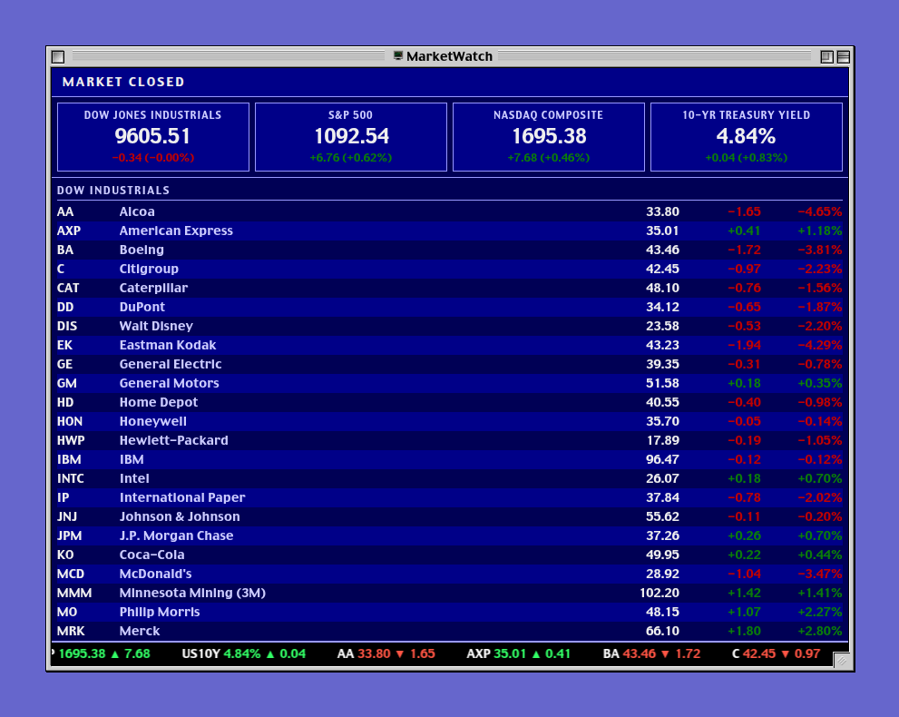

A trading-floor board of the U.S. markets: the Dow, S&P 500, Nasdaq, and 10-year Treasury, with the Dow 30 components listed below and a ticker crawling along the bottom. The board shows the last close from September 10 — the markets never opened on September 11, and the board reflects that as the day unfolds.

### Browser

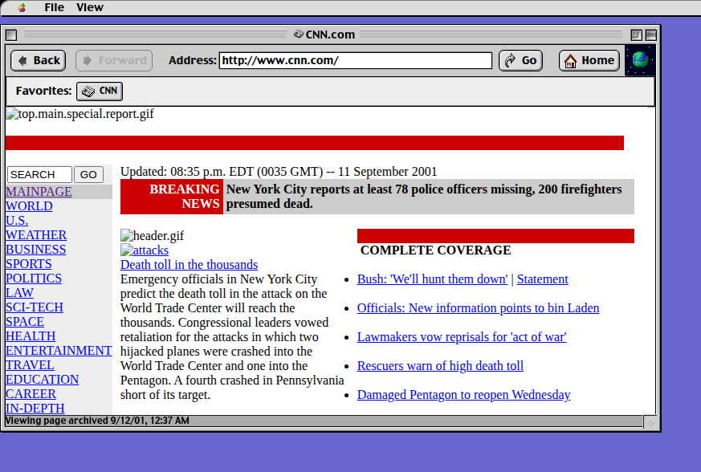

A retro web browser that fetches pages *as they were archived in September 2001* from the Wayback Machine, complete with back/forward navigation, an address bar, and a favorites bar. The status bar shows the exact archive timestamp of the page you're viewing. Try `cnn.com`, `apple.com`, or any site you remember from 2001.

On the hosted site this works immediately. Running locally, it needs the TimeMachine proxy — see [Running locally](#running-locally).

### Time Machine

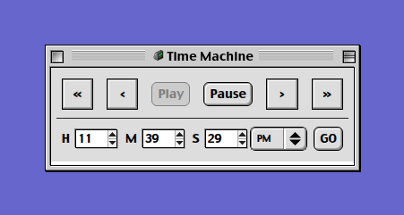

The remote control for the whole desktop. Skip backward/forward with the arrow buttons (**File → Settings** sets the skip size), pause and resume playback, or type an exact time and press **GO**. Every app follows.

### README

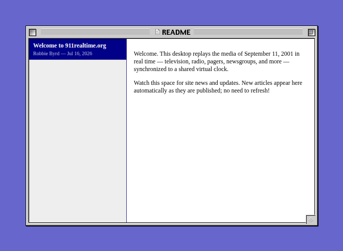

Site news and updates from the project, delivered to the desktop. New articles appear automatically as they're published — no refresh needed.

### Feedback

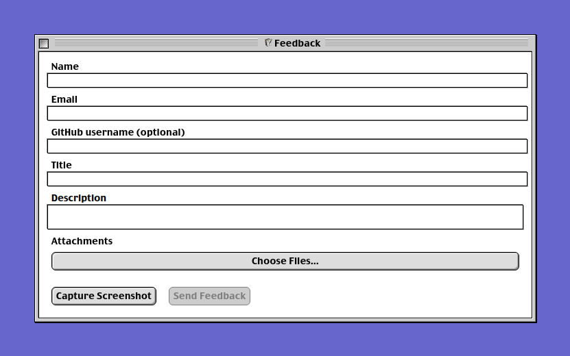

Found a bug, or have an idea? The Feedback app sends a report straight to the project — with optional attachments and a **Capture Screenshot** button that snapshots the desktop exactly as you see it.

### Account

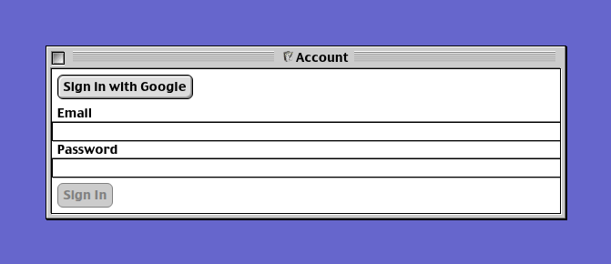

Sign in with Google or an email address. Accounts are used by educators: teachers can build **playlists** — guided, time-windowed lesson sessions that open specific apps at specific moments — and share them with a classroom via a link.

### Finder, and the rest of the system

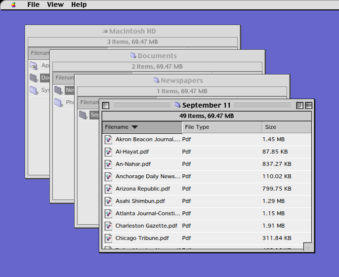

The desktop itself is a working file system. **Macintosh HD → Documents** holds:

- **Newspapers → September 11** — 49 front pages from the morning of September 12, from local U.S. dailies to international papers, readable in the built-in **PDF Viewer**.
- **Photos** — a photographic archive from the International Center of Photography, viewable in **Picture Viewer**.

The classic system accessories — **SimpleText**, **Movie Player**, the **Trash** — are all present and functional.

---

## On a phone

Visit the site on a phone or tablet and you'll get a different experience: an iPod-style shell with the same synchronized TV, radio, and media, built for a small touch screen. The desktop described above is the full experience and appears on any computer; curious desktop users can preview the mobile shell by adding `?ipod` to the URL.

---

## Running locally

The hosted beta at <https://beta.911realtime.org> is the easiest way to use the app. To run the frontend yourself:

```sh
pnpm install
pnpm dev          # dev server at http://localhost:5173
```

The dev build streams media from the project's servers (configured via `packages/frontend/.env`), so most apps work immediately.

**The Browser app** is the one exception — it needs the TimeMachine web proxy. From `packages/frontend`:

```sh
cp .env.example .env      # review settings
docker compose up -d      # starts the proxy on http://localhost:8765
```

Then open the Browser's **File → Settings** to confirm the proxy is enabled. See the main [README](README.md) for proxy configuration details.

---

## Tips

- **Let it play.** The site rewards patience more than clicking. Open TV, Flight Tracker, and Pager Decoder side by side a few minutes before 8:46, and let the day arrive.
- **The clock is the interface.** If an app seems quiet, it's because that moment was quiet. Jump the clock, not the app.
- **Watch the sky empty.** After the 9:26 ground stop, keep Flight Tracker open. By early afternoon, the aircraft-aloft counter — over 2,500 at breakfast — approaches zero.
- **Every window is honest.** Nothing in any app is dramatized or re-cut. If the TV anchor doesn't know yet, it's because at that minute, no one did.
