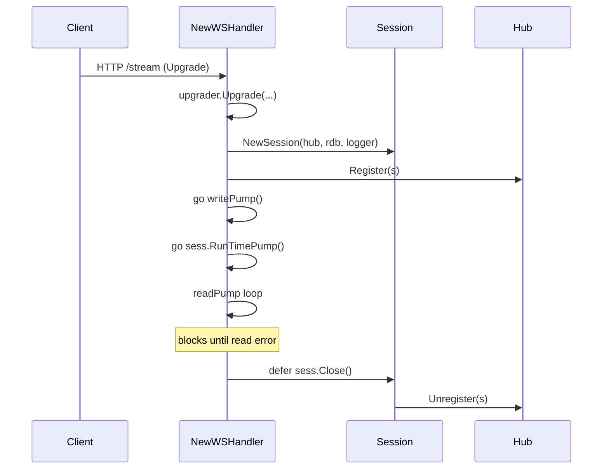

# `internal/handler`

The HTTP/WebSocket layer. Owns the upgrade handshake, the JSON message dispatch loop, and the two pump goroutines that bridge between the WebSocket and the `Session` state machine.

Source: [`internal/handler/ws.go`](../../internal/handler/ws.go).

---

## Public surface

```go
func NewWSHandler(
    hub *session.Hub,
    rdb *goredis.Client,
    pool *pgxpool.Pool,
    logger *slog.Logger,
) http.HandlerFunc
```

One function. Returns an `http.HandlerFunc` to be mounted on `/stream`. All the moving parts are closed over: hub, Redis client, Postgres pool, logger.

---

## What it does

For each incoming HTTP request:

1. **Upgrade** to WebSocket via `gorilla/websocket`.
2. **Create a session** and register it with the hub.
3. **Spawn `writePump`** (drains `session.Send()`, sends pings).
4. **Spawn `RunTimePump`** on the session (advances virtual time, dispatches items).
5. **Run `readPump`** inline — the for-loop in `NewWSHandler` itself. Blocks until the connection closes.
6. On exit, **close the session** (idempotent), which unregisters from the hub and propagates `done` to the other two goroutines.



---

## The upgrader

```go
var upgrader = websocket.Upgrader{
    ReadBufferSize:  1024,
    WriteBufferSize: 4096,
    CheckOrigin: func(r *http.Request) bool { return true },
}
```

- Buffers are sized for our message profile: small inbound (a few-key JSON envelope), bursty outbound (`items` payloads with several rows).
- `CheckOrigin` accepts everything. **In production, do origin enforcement at the proxy.** Adding it here would couple the streamer to a deployment-specific config that doesn't belong in the binary.

---

## Message envelopes

The handler parses each inbound message twice when needed: once into the small `inMsg` envelope to read the `type`, then optionally into a richer struct for messages with payload fields.

```go
type inMsg struct {
    Type string `json:"type"`
    Time string `json:"time,omitempty"`
}

type filterMsg struct {
    Type    string   `json:"type"`
    Formats []string `json:"formats"`
}
```

Why two structs? Because the `Type` field gates which other fields exist, and Go has no sum types. The pattern is:

1. Try `json.Unmarshal(raw, &inMsg)`. If that fails, send `"malformed message"` and continue.
2. Switch on `inMsg.Type`. For most types, `inMsg.Time` is the only payload field needed.
3. For richer payloads (`filter`'s `formats[]`), re-unmarshal into the message-specific struct.

If we ever add a fourth or fifth payload-carrying message type, consolidate into a single envelope with all possible fields and `omitempty`. Until then, the two-struct shape is fine.

---

## The dispatch table

```go
switch msg.Type {
case "init":      // db.CurrentItems → sess.Init
case "seek":      // db.CurrentItems → sess.Seek
case "heartbeat": // sess.Heartbeat
case "filter":    // sess.SetFormatFilter (after re-unmarshal)
case "pause":     // sess.Pause
case "resume":    // sess.Resume
default:          // sess.SendError(unknown type)
}
```

Each case is intentionally small: parse, query if needed, call one session method. The handler does **not** mutate session state directly — that's session's job. The handler does **not** call Redis directly — that's the time pump's job.

If you find yourself wanting to add a helper that calls multiple session methods or does conditional logic across them, ask whether it should be a single new session method instead.

---

## The three pump goroutines

### `readPump` (inline)

The for-loop at the bottom of `NewWSHandler`. Drives session state from inbound messages.

- Read limit: 4096 bytes per message. Larger frames return an error and end the connection.
- Read deadline: 120 seconds, reset on every inbound message and on every pong (via `SetPongHandler`).
- On error, the loop breaks, the `defer sess.Close()` fires, and the session ends.

### `writePump` (anonymous goroutine)

Drains `sess.Send()` and writes frames. Also runs a 30-second ticker for `PingMessage`.

```go
for {
    select {
    case <-sess.Done():
        return                                  // session closed elsewhere
    case msg := <-sess.Send():
        conn.SetWriteDeadline(time.Now().Add(10 * time.Second))
        if err := conn.WriteMessage(websocket.TextMessage, msg); err != nil {
            sess.Close(); return
        }
    case <-ping.C:
        conn.SetWriteDeadline(time.Now().Add(10 * time.Second))
        if err := conn.WriteMessage(websocket.PingMessage, nil); err != nil {
            sess.Close(); return
        }
    }
}
```

The write deadline of 10 s catches slow clients. A failed write closes the session, which propagates everywhere.

### `RunTimePump` (on the session)

Called as `go sess.RunTimePump()`. Lives in [`session/session.go`](../../internal/session/session.go); documented in [`session.md`](./session.md).

---

## Time parsing

```go
var timeFormats = []string{
    time.RFC3339,
    "2006-01-02T15:04:05",
    "2006-01-02 15:04:05",
    "2006-01-02 15:04:05.000000",
}

func parseTime(s string) (time.Time, error)
```

Tries each format in order. The fallbacks exist because:

- Naive ISO-8601 (`2006-01-02T15:04:05`) is what some JavaScript clients emit when they forget the `Z`.
- Space-separated formats match Postgres' default text encoding, which is what early scripts pasted in.
- Microsecond precision exists for parity with usenet ingest.

If you add a new format, append it. Order matters only for performance (RFC3339 is the common case and should be tried first).

---

## What the handler does **not** do

- **Authentication.** There is none. Add it at the proxy.
- **Rate limiting.** Same.
- **Caching of responses.** Init/seek hit Postgres directly. They're not on the hot path.
- **Connection state beyond the session.** Once `NewWSHandler` returns, all per-connection state is in the `Session` (which is in the hub) and the WebSocket (which is in the `defer conn.Close()` chain). There is no global connection registry separate from the hub.

---

## Failure modes

| Failure                              | Where caught                            | Outcome                            |
| ------------------------------------ | --------------------------------------- | ---------------------------------- |
| Upgrade fails                        | `upgrader.Upgrade` error                | Log + handler returns; no session  |
| Malformed JSON                       | `json.Unmarshal` error                  | `error` reply, session continues   |
| Unparseable timestamp                | `parseTime` error                       | `error` reply, session continues   |
| `db.CurrentItems` query error        | After the call                          | `error` reply, session continues   |
| Read error / deadline / size limit   | `conn.ReadMessage` error                | Loop breaks → `sess.Close()`       |
| Write error / deadline               | `conn.WriteMessage` error               | `sess.Close()` from writePump      |
| Slow client (send buffer full)       | `sess.send_` drop                       | Warn log; session continues        |
| Slow pong (read deadline)            | Same as read error                      | Loop breaks → `sess.Close()`       |

All session terminations route through `Session.Close()`, which is idempotent and triggers `Hub.Unregister`. There's no path that leaks a goroutine.

---

## Testing

To exercise this package hermetically:

- Stand up `*goredis.Client` via `miniredis` (see [`internal/cache/redis_test.go`](../../internal/cache/redis_test.go) for the pattern).
- Mock `*pgxpool.Pool` with `pgxmock` for unit-level coverage, or use `testcontainers-go` for the real overlap query.
- Drive the WebSocket end-to-end via `httptest.NewServer(mux)` and a `gorilla/websocket.Dialer` — the hub is dependency-free, just construct one with `session.NewHub(slog.New(...))`.

---

## When to change this

- **New client→server message.** Add a `case` to the switch, define a payload struct if needed, call one session method. Document it in [`websocket-protocol.md`](../websocket-protocol.md).
- **New server→client message.** No handler change — add a method on `Session` that builds an `outMsg` and `send_`s it. The writePump doesn't care about the type.
- **Changing the buffer/timeout constants.** Document the reasoning in this file. The current values are picked to match the message profile; changing them blind will surprise you.
- **Adding a non-`/stream` endpoint.** Wire it on the `http.ServeMux` in `main.go`. Keep the handler package focused on WebSocket — it's not a general HTTP router.
